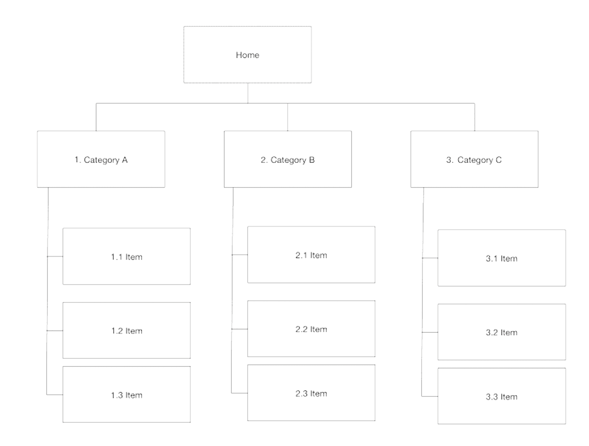
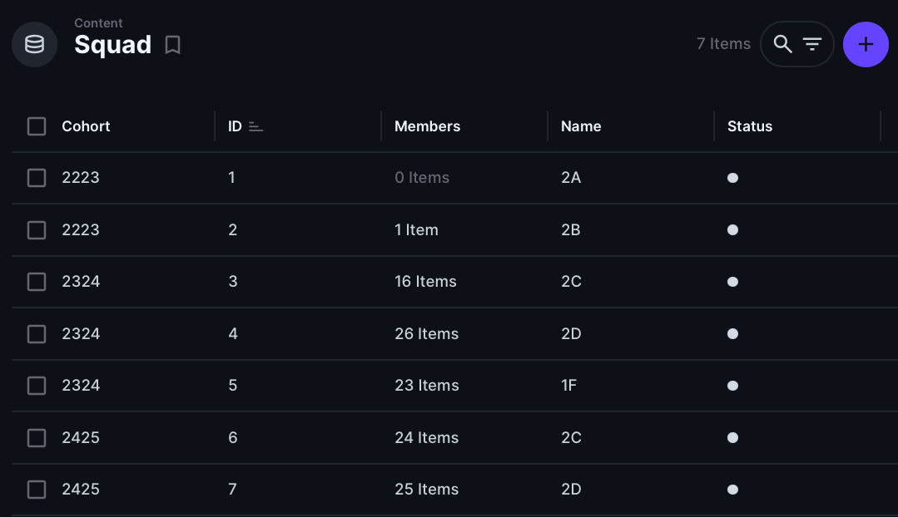

# Lose Your Head - The Client Case

## Datamodel

_In de workshop S14W2-02-informatie-architectuur wordt behandeld hoe het structureren en organiseren van informatie op de frontend invloed heeft op het Datamodel._

Analyseer de content stuctuur van de opdracht die jullie hebben gekregen en schets een datamodel waarmee de API kan worden ingericht.

### Aanpak

1. Schets een sitemap van de verschillende pagina's van de website die jullie gaan ontwerpen en maken.
2. Schets wireframes van de verschillende pagina's en noteer welke data statisch is en welke data dynamisch
3. Schets het datamodel van de content

### 1. Sitemap
Schets een sitemap van de verschillende pagina's van de opdracht die je deze week hebt gekregen (overzicht-, detail-, formulierpagina, etc ...)

1. Schrijf bovenaan de sitemap de ontwerpvraag van de opdrachtgever.
2. Onderzoek welke pagina's de website moet krijgen. Gebruik de briefing die je hebt gehad, de documentatie en/of het design dat je hebt gekregen.
3. Teken de homepage bovenaan en geef deze pagina nummer 0. Teken daarna alle pagina's die onder de homepage vallen en geef ze een nummer. Teken de pagina's die niveau dieper horen en geef ze de nummers 2.1, 2.2, ... als ze onder pagina 2.0 vallen. Teken een niveau dieper als er nog meer pagina's zijn, pas de nummering aan, trek lijnen, etc ...

### 2. Wireframes en data
Teken nette wireframes van de verschillende pagina van de website die je gaat ontwerpen en maken, en bepaal welke data dynamisch moet worden. 

1. Schets wireframes van de verschillende pagina's. Schets netjes met rechte lijnen, zorg dat elementen de juiste verhoudingen en formaten hebben. Zorg ervoor dat je alle content uitschrijft om een goed beeld te krijgen wat voor informatie op de pagina's getoond gaat worden.
2. Geef aan welke content statisch is en welke dynamisch (wat in de database moet komen).
3. Noteer het organisatie schema en kenmerk van de dynamische informatie (b.v. organisatieschema: alfabetisch, kenmerk: titel)

### 3. Datamodel
Een datamodel laat de logische structuur van een database zien, inclusief de relaties tussen tabellen.

1. Bedenk aan de hand van de wireframes wat voor tabellen jouw project nodig heeft. Let op data die wordt herhaald (zoals de artikelen in een blog uit het voorbeeld hierboven).
2. Schets een datamodel; bedenk logische titels voor de tabellen, noteer de kolom naam en de data types.
3. Bedenk welke tabelen aan elkaar gerelateerd moeten zijn.
4. Bespreek jullie datamodel met een docent en gebruik het om Directus in te richten.

*Tabel in Directus met kolom namen.*

### Bronnen

- [Site Mapping How To](https://slickplan.com/blog/site-mapping-a-comprehensive-guide)
- [Directus Data Model](https://docs.directus.io/app/data-model.html)
